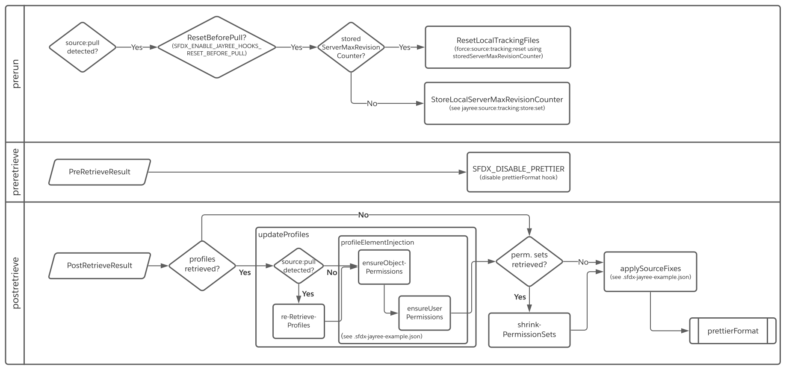

# sfdx-jayree

sfdx ALM commands & more

[](https://developer.salesforce.com/tools/sfdxcli)
[](https://npmjs.org/package/sfdx-jayree)
[](https://circleci.com/gh/jayree/sfdx-jayree-plugin/tree/main)
[](https://ci.appveyor.com/project/jayree/sfdx-jayree-plugin/branch/main)
[](https://codecov.io/gh/jayree/sfdx-jayree-plugin)
[](https://npmjs.org/package/sfdx-jayree)
[](https://github.com/jayree/sfdx-jayree-plugin/blob/main/package.json)
[](https://gitter.im/sfdx-jayree-plugin/community?utm_source=badge&utm_medium=badge&utm_campaign=pr-badge)

<!-- toc -->
* [Usage](#usage)
* [Commands](#commands)
* [Hooks](#hooks)
<!-- tocstop -->

## Usage

<!-- usage -->
```sh-session
$ sfdx plugins:install sfdx-jayree
$ sfdx jayree:COMMAND
running command...
$ sfdx plugins
sfdx-jayree 3.12.1
$ sfdx help jayree:COMMAND
USAGE
  $ sfdx jayree:COMMAND
...
```
<!-- usagestop -->

## Commands

<!-- commands -->
* [`sfdx jayree:automation:changeset:deploy`](#sfdx-jayreeautomationchangesetdeploy)
* [`sfdx jayree:automation:changeset:list`](#sfdx-jayreeautomationchangesetlist)
* [`sfdx jayree:automation:ltngsync:status`](#sfdx-jayreeautomationltngsyncstatus)
* [`sfdx jayree:flowtestcoverage`](#sfdx-jayreeflowtestcoverage)
* [`sfdx jayree:manifest:cleanup`](#sfdx-jayreemanifestcleanup)
* [`sfdx jayree:manifest:generate`](#sfdx-jayreemanifestgenerate)
* [`sfdx jayree:manifest:git:diff`](#sfdx-jayreemanifestgitdiff)
* [`sfdx jayree:org:configure`](#sfdx-jayreeorgconfigure)
* [`sfdx jayree:org:configure:country`](#sfdx-jayreeorgconfigurecountry)
* [`sfdx jayree:org:configure:state`](#sfdx-jayreeorgconfigurestate)
* [`sfdx jayree:org:open`](#sfdx-jayreeorgopen)
* [`sfdx jayree:org:settings`](#sfdx-jayreeorgsettings)
* [`sfdx jayree:org:streaming`](#sfdx-jayreeorgstreaming)
* [`sfdx jayree:packagedescription:create`](#sfdx-jayreepackagedescriptioncreate)
* [`sfdx jayree:packagedescription:get`](#sfdx-jayreepackagedescriptionget)
* [`sfdx jayree:packagedescription:remove`](#sfdx-jayreepackagedescriptionremove)
* [`sfdx jayree:packagedescription:set`](#sfdx-jayreepackagedescriptionset)
* [`sfdx jayree:source:fix`](#sfdx-jayreesourcefix)
* [`sfdx jayree:source:tracking:list`](#sfdx-jayreesourcetrackinglist)
* [`sfdx jayree:source:tracking:store:get`](#sfdx-jayreesourcetrackingstoreget)
* [`sfdx jayree:source:tracking:store:set`](#sfdx-jayreesourcetrackingstoreset)

### `sfdx jayree:automation:changeset:deploy`

deploy incomming change set to an org (beta)

```
USAGE
  $ sfdx jayree:automation:changeset:deploy [-r <string> -l <string>] [-c] [--nodialog -s <string>] [-u <string>] 
  [--apiversion <string>] [--json] [--loglevel trace|debug|info|warn|error|fatal|TRACE|DEBUG|INFO|WARN|ERROR|FATAL]

OPTIONS
  -c, --checkonly                                                                   validate deploy but don’t save to
                                                                                    the org (default:false)

  -l, --testlevel=Default|RunSpecifiedTests|RunLocalTests|RunAllTestsInOrg          deployment testing level
                                                                                    (Default,RunSpecifiedTests,RunLocalT
                                                                                    ests,RunAllTestsInOrg)

  -r, --runtests=runtests                                                           tests to run if --testlevel
                                                                                    RunSpecifiedTests

  -s, --changeset=changeset                                                         name of changeset to deploy

  -u, --targetusername=targetusername                                               username or alias for the target
                                                                                    org; overrides default target org

  --apiversion=apiversion                                                           override the api version used for
                                                                                    api requests made by this command

  --json                                                                            format output as json

  --loglevel=(trace|debug|info|warn|error|fatal|TRACE|DEBUG|INFO|WARN|ERROR|FATAL)  [default: warn] logging level for
                                                                                    this command invocation

  --nodialog                                                                        don't show the dialog wizard

EXAMPLES
  $ sfdx jayree:automation:changeset:deploy -s ChangeSet -l RunLocalTests --nodialog
  Deploying Change Set 'ChangeSet'...

  === Status
  Status: Pending
  jobid:  0Xxx100000xx1x1

  $ sfdx jayree:automation:changeset:deploy
  ? Change Sets Awaiting Deployment (Use arrow keys)
    ChangeSet3
    ChangeSet2
  ❯ ChangeSet1
```

_See code: [src/commands/jayree/automation/changeset/deploy.ts](https://github.com/jayree/sfdx-jayree-plugin/blob/v3.12.1/src/commands/jayree/automation/changeset/deploy.ts)_

### `sfdx jayree:automation:changeset:list`

list incomming change sets of an org (beta)

```
USAGE
  $ sfdx jayree:automation:changeset:list [-u <string>] [--apiversion <string>] [--json] [--loglevel 
  trace|debug|info|warn|error|fatal|TRACE|DEBUG|INFO|WARN|ERROR|FATAL]

OPTIONS
  -u, --targetusername=targetusername                                               username or alias for the target
                                                                                    org; overrides default target org

  --apiversion=apiversion                                                           override the api version used for
                                                                                    api requests made by this command

  --json                                                                            format output as json

  --loglevel=(trace|debug|info|warn|error|fatal|TRACE|DEBUG|INFO|WARN|ERROR|FATAL)  [default: warn] logging level for
                                                                                    this command invocation
```

_See code: [src/commands/jayree/automation/changeset/list.ts](https://github.com/jayree/sfdx-jayree-plugin/blob/v3.12.1/src/commands/jayree/automation/changeset/list.ts)_

### `sfdx jayree:automation:ltngsync:status`

check the Lightning Sync User Sync Status and reset sync if needed (beta)

```
USAGE
  $ sfdx jayree:automation:ltngsync:status -o <string> [-s] [-w <integer>] [-u <string>] [--apiversion <string>] 
  [--json] [--loglevel trace|debug|info|warn|error|fatal|TRACE|DEBUG|INFO|WARN|ERROR|FATAL]

OPTIONS
  -o, --officeuser=officeuser                                                       (required) 'name' (firstname
                                                                                    lastname) of the SF user

  -s, --statusonly                                                                  get Lightning Sync status of the SF
                                                                                    user, only

  -u, --targetusername=targetusername                                               username or alias for the target
                                                                                    org; overrides default target org

  -w, --wait=wait                                                                   wait time for command to wait for
                                                                                    status change in minutes (default:
                                                                                    infinitely)

  --apiversion=apiversion                                                           override the api version used for
                                                                                    api requests made by this command

  --json                                                                            format output as json

  --loglevel=(trace|debug|info|warn|error|fatal|TRACE|DEBUG|INFO|WARN|ERROR|FATAL)  [default: warn] logging level for
                                                                                    this command invocation

EXAMPLE
  $ sfdx jayree:automation:ltngsync:status -o 'Name'
       configSetup: User assigned to active Lightning Sync configuration... Yes
       userContacts/userEvents: Salesforce and Exchange email addresses linked... Linked/Linked
       userContacts/userEvents: Salesforce to Exchange sync status... Initial sync completed/Initial sync completed
       userContacts/userEvents: Exchange to Salesforce sync status... Initial sync completed/Initial sync completed
```

_See code: [src/commands/jayree/automation/ltngsync/status.ts](https://github.com/jayree/sfdx-jayree-plugin/blob/v3.12.1/src/commands/jayree/automation/ltngsync/status.ts)_

### `sfdx jayree:flowtestcoverage`

check the flow test coverage of an org

```
USAGE
  $ sfdx jayree:flowtestcoverage [-u <string>] [--apiversion <string>] [--json] [--loglevel 
  trace|debug|info|warn|error|fatal|TRACE|DEBUG|INFO|WARN|ERROR|FATAL]

OPTIONS
  -u, --targetusername=targetusername                                               username or alias for the target
                                                                                    org; overrides default target org

  --apiversion=apiversion                                                           override the api version used for
                                                                                    api requests made by this command

  --json                                                                            format output as json

  --loglevel=(trace|debug|info|warn|error|fatal|TRACE|DEBUG|INFO|WARN|ERROR|FATAL)  [default: warn] logging level for
                                                                                    this command invocation

EXAMPLE
  $ sfdx jayree:flowtestcoverage
  === Flow Test Coverage
  Coverage: 82%
  ...
```

_See code: [src/commands/jayree/flowtestcoverage.ts](https://github.com/jayree/sfdx-jayree-plugin/blob/v3.12.1/src/commands/jayree/flowtestcoverage.ts)_

### `sfdx jayree:manifest:cleanup`

removes those tags from a manifest file that are present in a second manifest file

```
USAGE
  $ sfdx jayree:manifest:cleanup [-x <filepath>] [-f <filepath>] [--json] [--loglevel 
  trace|debug|info|warn|error|fatal|TRACE|DEBUG|INFO|WARN|ERROR|FATAL]

OPTIONS
  -f, --file=file                                                                   path to the second manifest file
  -x, --manifest=manifest                                                           path to the manifest file
  --json                                                                            format output as json

  --loglevel=(trace|debug|info|warn|error|fatal|TRACE|DEBUG|INFO|WARN|ERROR|FATAL)  [default: warn] logging level for
                                                                                    this command invocation
```

_See code: [src/commands/jayree/manifest/cleanup.ts](https://github.com/jayree/sfdx-jayree-plugin/blob/v3.12.1/src/commands/jayree/manifest/cleanup.ts)_

### `sfdx jayree:manifest:generate`

generate a complete package xml form the specified org

```
USAGE
  $ sfdx jayree:manifest:generate [--configfile <string>] [-q <string>] [-c] [-w] [--includeflowversions] [-f <string>] 
  [-x] [-u <string>] [--apiversion <string>] [--json] [--loglevel 
  trace|debug|info|warn|error|fatal|TRACE|DEBUG|INFO|WARN|ERROR|FATAL]

OPTIONS
  -c, --matchcase                                                                   enable 'match case' for the
                                                                                    quickfilter

  -f, --file=file                                                                   write to 'file' instead of stdout

  -q, --quickfilter=quickfilter                                                     csv separated list of metadata type,
                                                                                    member or file names to filter on

  -u, --targetusername=targetusername                                               username or alias for the target
                                                                                    org; overrides default target org

  -w, --matchwholeword                                                              enable 'match whole word' for the
                                                                                    quickfilter

  -x, --excludemanaged                                                              exclude managed packages from output

  --apiversion=apiversion                                                           override the api version used for
                                                                                    api requests made by this command

  --configfile=configfile                                                           path to config file

  --includeflowversions                                                             include flow versions as with api
                                                                                    version 43.0

  --json                                                                            format output as json

  --loglevel=(trace|debug|info|warn|error|fatal|TRACE|DEBUG|INFO|WARN|ERROR|FATAL)  [default: warn] logging level for
                                                                                    this command invocation

ALIASES
  $ sfdx jayree:packagexml

EXAMPLE
  $ sfdx jayree:manifest:generate --targetusername myOrg@example.com
       <?xml version="1.0" encoding="UTF-8"?>
       <Package xmlns="http://soap.sforce.com/2006/04/metadata">...</Package>
```

_See code: [src/commands/jayree/manifest/generate.ts](https://github.com/jayree/sfdx-jayree-plugin/blob/v3.12.1/src/commands/jayree/manifest/generate.ts)_

### `sfdx jayree:manifest:git:diff`

create a manifest and destructiveChanges manifest using 'git diff' data

```
USAGE
  $ sfdx jayree:manifest:git:diff [--json] [--loglevel 
  trace|debug|info|warn|error|fatal|TRACE|DEBUG|INFO|WARN|ERROR|FATAL]

ARGUMENTS
  REF1  base commit or branch
  REF2  commit or branch to compare to the base commit

OPTIONS
  --json                                                                            format output as json

  --loglevel=(trace|debug|info|warn|error|fatal|TRACE|DEBUG|INFO|WARN|ERROR|FATAL)  [default: warn] logging level for
                                                                                    this command invocation

DESCRIPTION
  Creates a manifest and destructiveChanges manifest using 'git diff' data.

  You can use all ways to spell <commit> which are valid for 'git diff'.
  (See https://git-scm.com/docs/git-diff)

EXAMPLES
  $ sfdx jayree:manifest:git:diff <commit> <commit>
  $ sfdx jayree:manifest:git:diff <commit>..<commit>
  uses the changes between two arbitrary <commit>

  $ sfdx jayree:manifest:git:diff <commit>...<commit>
  uses the changes on the branch containing and up to the second <commit>, starting at a common ancestor of both 
  <commit>.
    
  $ sfdx jayree:manifest:git:diff branchA..branchB
  uses the diff of what is unique in branchB (REF2) and unique in branchA (REF1)

  $ sfdx jayree:manifest:git:diff branchA...branchB
  uses the diff of what is unique in branchB (REF2)
```

_See code: [src/commands/jayree/manifest/git/diff.ts](https://github.com/jayree/sfdx-jayree-plugin/blob/v3.12.1/src/commands/jayree/manifest/git/diff.ts)_

### `sfdx jayree:org:configure`

make configuration changes that are not covered by the metadata API

```
USAGE
  $ sfdx jayree:org:configure [-t <array>] [--concurrent] [-u <string>] [--apiversion <string>] [--json] [--loglevel 
  trace|debug|info|warn|error|fatal|TRACE|DEBUG|INFO|WARN|ERROR|FATAL]

OPTIONS
  -t, --tasks=tasks                                                                 list of task titles, if no tasks are
                                                                                    specified, all tasks marked as
                                                                                    active will be executed

  -u, --targetusername=targetusername                                               username or alias for the target
                                                                                    org; overrides default target org

  --apiversion=apiversion                                                           override the api version used for
                                                                                    api requests made by this command

  --concurrent                                                                      execute tasks in parallel

  --json                                                                            format output as json

  --loglevel=(trace|debug|info|warn|error|fatal|TRACE|DEBUG|INFO|WARN|ERROR|FATAL)  [default: warn] logging level for
                                                                                    this command invocation

DESCRIPTION
  See example configuration on how to define tasks

EXAMPLE
  $ sfdx jayree:org:configure
  $ sfdx jayree:org:configure -u me@my.org
  $ sfdx jayree:org:configure --tasks="Asset Settings","Activity Settings"
  $ sfdx jayree:org:configure --concurrent --tasks="Asset Settings","Activity Settings"
```

_See code: [src/commands/jayree/org/configure/index.ts](https://github.com/jayree/sfdx-jayree-plugin/blob/v3.12.1/src/commands/jayree/org/configure/index.ts)_

### `sfdx jayree:org:configure:country`

update country integration values in the State/Country Picklists

```
USAGE
  $ sfdx jayree:org:configure:country [-u <string>] [--apiversion <string>] [--json] [--loglevel 
  trace|debug|info|warn|error|fatal|TRACE|DEBUG|INFO|WARN|ERROR|FATAL]

OPTIONS
  -u, --targetusername=targetusername                                               username or alias for the target
                                                                                    org; overrides default target org

  --apiversion=apiversion                                                           override the api version used for
                                                                                    api requests made by this command

  --json                                                                            format output as json

  --loglevel=(trace|debug|info|warn|error|fatal|TRACE|DEBUG|INFO|WARN|ERROR|FATAL)  [default: warn] logging level for
                                                                                    this command invocation

ALIASES
  $ sfdx jayree:automation:country:update
```

_See code: [src/commands/jayree/org/configure/country.ts](https://github.com/jayree/sfdx-jayree-plugin/blob/v3.12.1/src/commands/jayree/org/configure/country.ts)_

### `sfdx jayree:org:configure:state`

import (create/update) states into the State/Country Picklists

```
USAGE
  $ sfdx jayree:org:configure:state [--countrycode <string>] [--category <string>] [--language <string>] [--concurrent 
  <integer>] [-u <string>] [--apiversion <string>] [--json] [--loglevel 
  trace|debug|info|warn|error|fatal|TRACE|DEBUG|INFO|WARN|ERROR|FATAL]

OPTIONS
  -u, --targetusername=targetusername                                               username or alias for the target
                                                                                    org; overrides default target org

  --apiversion=apiversion                                                           override the api version used for
                                                                                    api requests made by this command

  --category=category                                                               Subdivision category

  --concurrent=concurrent                                                           [default: 1] ccc

  --countrycode=countrycode                                                         Alpha-2 code

  --json                                                                            format output as json

  --language=language                                                               Language code

  --loglevel=(trace|debug|info|warn|error|fatal|TRACE|DEBUG|INFO|WARN|ERROR|FATAL)  [default: warn] logging level for
                                                                                    this command invocation

ALIASES
  $ sfdx jayree:automation:statecountry:import
  $ sfdx jayree:automation:statecountry:create
  $ sfdx jayree:automation:statecountry:update
  $ sfdx jayree:automation:state:import
```

_See code: [src/commands/jayree/org/configure/state.ts](https://github.com/jayree/sfdx-jayree-plugin/blob/v3.12.1/src/commands/jayree/org/configure/state.ts)_

### `sfdx jayree:org:open`

open an org in your preferred browser

```
USAGE
  $ sfdx jayree:org:open [-b <string>] [-p <string>] [-r] [-u <string>] [--apiversion <string>] [--json] [--loglevel 
  trace|debug|info|warn|error|fatal|TRACE|DEBUG|INFO|WARN|ERROR|FATAL]

OPTIONS
  -b, --browser=firefox|chrome|edge|safari                                          [default: chrome] browser to be
                                                                                    launched

  -p, --path=path                                                                   navigation URL path

  -r, --urlonly                                                                     display navigation URL, but don’t
                                                                                    launch browser

  -u, --targetusername=targetusername                                               username or alias for the target
                                                                                    org; overrides default target org

  --apiversion=apiversion                                                           override the api version used for
                                                                                    api requests made by this command

  --json                                                                            format output as json

  --loglevel=(trace|debug|info|warn|error|fatal|TRACE|DEBUG|INFO|WARN|ERROR|FATAL)  [default: warn] logging level for
                                                                                    this command invocation

EXAMPLE
  $ sfdx jayree:org:open
  $ sfdx jayree:org:open -u me@my.org
  $ sfdx jayree:org:open -u MyTestOrg1 -b firefox
  $ sfdx jayree:org:open -r -p lightning -b safari
  $ sfdx jayree:org:open -u me@my.org
```

_See code: [src/commands/jayree/org/open.ts](https://github.com/jayree/sfdx-jayree-plugin/blob/v3.12.1/src/commands/jayree/org/open.ts)_

### `sfdx jayree:org:settings`

write the current settings from an Org to a scratch org def file

```
USAGE
  $ sfdx jayree:org:settings [-w] [-f <string>] [-u <string>] [--apiversion <string>] [--json] [--loglevel 
  trace|debug|info|warn|error|fatal|TRACE|DEBUG|INFO|WARN|ERROR|FATAL]

OPTIONS
  -f, --file=file                                                                   write to 'file' instead of
                                                                                    project-scratch-def.json

  -u, --targetusername=targetusername                                               username or alias for the target
                                                                                    org; overrides default target org

  -w, --writetoprojectscratchdeffile                                                write output to
                                                                                    project-scratch-def.json file

  --apiversion=apiversion                                                           override the api version used for
                                                                                    api requests made by this command

  --json                                                                            format output as json

  --loglevel=(trace|debug|info|warn|error|fatal|TRACE|DEBUG|INFO|WARN|ERROR|FATAL)  [default: warn] logging level for
                                                                                    this command invocation

ALIASES
  $ sfdx jayree:scratchorg:settings

EXAMPLE
  $ sfdx jayree:org:settings
  $ sfdx jayree:org:settings -u me@my.org
  $ sfdx jayree:org:settings -u MyTestOrg1 -w
```

_See code: [src/commands/jayree/org/settings.ts](https://github.com/jayree/sfdx-jayree-plugin/blob/v3.12.1/src/commands/jayree/org/settings.ts)_

### `sfdx jayree:org:streaming`

listen to streaming api and platform events

```
USAGE
  $ sfdx jayree:org:streaming -p <string> [-u <string>] [--apiversion <string>] [--json] [--loglevel 
  trace|debug|info|warn|error|fatal|TRACE|DEBUG|INFO|WARN|ERROR|FATAL]

OPTIONS
  -p, --topic=topic                                                                 (required) topic name

  -u, --targetusername=targetusername                                               username or alias for the target
                                                                                    org; overrides default target org

  --apiversion=apiversion                                                           override the api version used for
                                                                                    api requests made by this command

  --json                                                                            format output as json

  --loglevel=(trace|debug|info|warn|error|fatal|TRACE|DEBUG|INFO|WARN|ERROR|FATAL)  [default: warn] logging level for
                                                                                    this command invocation

EXAMPLE
  $ sfdx jayree:org:streaming --topic=/event/eventName__e
  ...
```

_See code: [src/commands/jayree/org/streaming.ts](https://github.com/jayree/sfdx-jayree-plugin/blob/v3.12.1/src/commands/jayree/org/streaming.ts)_

### `sfdx jayree:packagedescription:create`

creates an empty package with the description

```
USAGE
  $ sfdx jayree:packagedescription:create (-d <string> -f <string>) [--json] [--loglevel 
  trace|debug|info|warn|error|fatal|TRACE|DEBUG|INFO|WARN|ERROR|FATAL]

OPTIONS
  -d, --description=description                                                     (required) new description value
  -f, --file=file                                                                   (required) file to create
  --json                                                                            format output as json

  --loglevel=(trace|debug|info|warn|error|fatal|TRACE|DEBUG|INFO|WARN|ERROR|FATAL)  [default: warn] logging level for
                                                                                    this command invocation

EXAMPLE
  $ sfdx jayree:packagedescription:create --file FILENAME --description 'DESCRIPTION'
```

_See code: [src/commands/jayree/packagedescription/create.ts](https://github.com/jayree/sfdx-jayree-plugin/blob/v3.12.1/src/commands/jayree/packagedescription/create.ts)_

### `sfdx jayree:packagedescription:get`

get the description within a package

```
USAGE
  $ sfdx jayree:packagedescription:get -f <string> [--json] [--loglevel 
  trace|debug|info|warn|error|fatal|TRACE|DEBUG|INFO|WARN|ERROR|FATAL]

OPTIONS
  -f, --file=file                                                                   (required) file to read
  --json                                                                            format output as json

  --loglevel=(trace|debug|info|warn|error|fatal|TRACE|DEBUG|INFO|WARN|ERROR|FATAL)  [default: warn] logging level for
                                                                                    this command invocation

EXAMPLE
  $ sfdx jayree:packagedescription:get --file FILENAME
       Description of Package FILENAME
```

_See code: [src/commands/jayree/packagedescription/get.ts](https://github.com/jayree/sfdx-jayree-plugin/blob/v3.12.1/src/commands/jayree/packagedescription/get.ts)_

### `sfdx jayree:packagedescription:remove`

remove the description within a package

```
USAGE
  $ sfdx jayree:packagedescription:remove -f <string> [--json] [--loglevel 
  trace|debug|info|warn|error|fatal|TRACE|DEBUG|INFO|WARN|ERROR|FATAL]

OPTIONS
  -f, --file=file                                                                   (required) file to read
  --json                                                                            format output as json

  --loglevel=(trace|debug|info|warn|error|fatal|TRACE|DEBUG|INFO|WARN|ERROR|FATAL)  [default: warn] logging level for
                                                                                    this command invocation

EXAMPLE
  $ sfdx jayree:packagedescription:remove --file FILENAME
```

_See code: [src/commands/jayree/packagedescription/remove.ts](https://github.com/jayree/sfdx-jayree-plugin/blob/v3.12.1/src/commands/jayree/packagedescription/remove.ts)_

### `sfdx jayree:packagedescription:set`

set the description within a package

```
USAGE
  $ sfdx jayree:packagedescription:set (-d <string> -f <string>) [--json] [--loglevel 
  trace|debug|info|warn|error|fatal|TRACE|DEBUG|INFO|WARN|ERROR|FATAL]

OPTIONS
  -d, --description=description                                                     (required) new description value
  -f, --file=file                                                                   (required) file to read
  --json                                                                            format output as json

  --loglevel=(trace|debug|info|warn|error|fatal|TRACE|DEBUG|INFO|WARN|ERROR|FATAL)  [default: warn] logging level for
                                                                                    this command invocation

EXAMPLE
  $ sfdx jayree:packagedescription:set --file FILENAME --description 'NEW DESCRIPTION'
```

_See code: [src/commands/jayree/packagedescription/set.ts](https://github.com/jayree/sfdx-jayree-plugin/blob/v3.12.1/src/commands/jayree/packagedescription/set.ts)_

### `sfdx jayree:source:fix`

fix local source files

```
USAGE
  $ sfdx jayree:source:fix [-t <array>] [-u <string>] [--apiversion <string>] [--verbose] [--json] [--loglevel 
  trace|debug|info|warn|error|fatal|TRACE|DEBUG|INFO|WARN|ERROR|FATAL]

OPTIONS
  -t, --tag=tag                                                                     comma-separated list of tag names
                                                                                    listed in .sfdx-jayree.json

  -u, --targetusername=targetusername                                               username or alias for the target
                                                                                    org; overrides default target org

  --apiversion=apiversion                                                           override the api version used for
                                                                                    api requests made by this command

  --json                                                                            format output as json

  --loglevel=(trace|debug|info|warn|error|fatal|TRACE|DEBUG|INFO|WARN|ERROR|FATAL)  [default: warn] logging level for
                                                                                    this command invocation

  --verbose                                                                         log output to console

DESCRIPTION
  (examples will follow)
```

_See code: [src/commands/jayree/source/fix.ts](https://github.com/jayree/sfdx-jayree-plugin/blob/v3.12.1/src/commands/jayree/source/fix.ts)_

### `sfdx jayree:source:tracking:list`

list changes in a scratch org by remote revision counter number

```
USAGE
  $ sfdx jayree:source:tracking:list [-r <integer>] [-u <string>] [--apiversion <string>] [--json] [--loglevel 
  trace|debug|info|warn|error|fatal|TRACE|DEBUG|INFO|WARN|ERROR|FATAL]

OPTIONS
  -r, --revision=revision                                                           start at a specific revision counter
                                                                                    number (default: 0)

  -u, --targetusername=targetusername                                               username or alias for the target
                                                                                    org; overrides default target org

  --apiversion=apiversion                                                           override the api version used for
                                                                                    api requests made by this command

  --json                                                                            format output as json

  --loglevel=(trace|debug|info|warn|error|fatal|TRACE|DEBUG|INFO|WARN|ERROR|FATAL)  [default: warn] logging level for
                                                                                    this command invocation

EXAMPLE
  $ sfdx jayree:source:tracking:list
  $ sfdx jayree:source:tracking:list -u me@my.org
  $ sfdx jayree:source:tracking:list -u me@my.org -r 101
```

_See code: [src/commands/jayree/source/tracking/list.ts](https://github.com/jayree/sfdx-jayree-plugin/blob/v3.12.1/src/commands/jayree/source/tracking/list.ts)_

### `sfdx jayree:source:tracking:store:get`

get stored revision counter number

```
USAGE
  $ sfdx jayree:source:tracking:store:get [-u <string>] [--apiversion <string>] [--json] [--loglevel 
  trace|debug|info|warn|error|fatal|TRACE|DEBUG|INFO|WARN|ERROR|FATAL]

OPTIONS
  -u, --targetusername=targetusername                                               username or alias for the target
                                                                                    org; overrides default target org

  --apiversion=apiversion                                                           override the api version used for
                                                                                    api requests made by this command

  --json                                                                            format output as json

  --loglevel=(trace|debug|info|warn|error|fatal|TRACE|DEBUG|INFO|WARN|ERROR|FATAL)  [default: warn] logging level for
                                                                                    this command invocation

EXAMPLE
  $ sfdx jayree:source:tracking:store:get
  $ sfdx jayree:source:tracking:store:get -u me@my.org
```

_See code: [src/commands/jayree/source/tracking/store/get.ts](https://github.com/jayree/sfdx-jayree-plugin/blob/v3.12.1/src/commands/jayree/source/tracking/store/get.ts)_

### `sfdx jayree:source:tracking:store:set`

store revision counter number

```
USAGE
  $ sfdx jayree:source:tracking:store:set [-r <integer>] [-u <string>] [--apiversion <string>] [--json] [--loglevel 
  trace|debug|info|warn|error|fatal|TRACE|DEBUG|INFO|WARN|ERROR|FATAL]

OPTIONS
  -r, --revision=revision                                                           revision counter number (default:
                                                                                    remote revision counter number)

  -u, --targetusername=targetusername                                               username or alias for the target
                                                                                    org; overrides default target org

  --apiversion=apiversion                                                           override the api version used for
                                                                                    api requests made by this command

  --json                                                                            format output as json

  --loglevel=(trace|debug|info|warn|error|fatal|TRACE|DEBUG|INFO|WARN|ERROR|FATAL)  [default: warn] logging level for
                                                                                    this command invocation

EXAMPLE
  $ sfdx jayree:source:tracking:store:set
  $ sfdx jayree:source:tracking:store:set -u me@my.org
  $ sfdx jayree:source:tracking:store:set -u MyTestOrg1 -r 101
```

_See code: [src/commands/jayree/source/tracking/store/set.ts](https://github.com/jayree/sfdx-jayree-plugin/blob/v3.12.1/src/commands/jayree/source/tracking/store/set.ts)_
<!-- commandsstop -->

## Hooks

The following hooks are triggered after running `force:source:retrieve` or `force:source:pull`. They extend both standard commands with the same logic as `jayree:source:retrieve:all` and `jayree:source:retrieve:full`.

### Enable/Disable

Set the following parameter in `.sfdx-jayree.json` to enable (true) or disable (false) the hooks:

```json
{
  "runHooks": true,
}
```

### Hook flow



#### prerun

- Resets source tracking using `force:source:tracking:reset` before executing `force:source:pull`.

> **_IMPORTANT:_** This hook will only run if  `SFDX_ENABLE_JAYREE_HOOKS_RESET_BEFORE_PULL=true` is set. It uses the stored `serverMaxRevisionCounter` as revision counter number (see: [`jayree:source:tracking:store:set`](#sfdx-jayreesourcetrackingstoreset)). If the hook doesn't find a stored value it asks if the current *local* revision counter number should be stored and used.

#### preretrieve

- Disables the `prettierFormat` hook. See [sfdx-plugin-prettier](https://github.com/jayree/sfdx-plugin-prettier) for more details.

#### postretrieve (plugin-source plugin) / postsourceupdate (legacy salesforce-alm plugin)

- Re-retrieves Profiles if `source:pull` triggered the hook.
- Ensures Object- and User-Permissions settings. Review [.sfdx-jayree-example.json](.sfdx-jayree-example.json) how the configuration should look like.
- Shrinks Permission Sets to avoid merge conflicts in git.
- Applies source fixes of the `jayree:source:fix` command and moves source files to separate package directories. See the configuration file [.sfdx-jayree-example.json](.sfdx-jayree-example.json) for examples. Use the following parameter in `.sfdx-jayree.json` to specify which tags should be applied by the hooks:
```json
{
  "applySourceFixes": ["source:retrieve:full", "source:retrieve:all"],
}
```

> **_IMPORTANT:_** Since the hook is not able to update the (JSON) output of the command, an additional output is generated. Set the environment variable `SFDX_ENABLE_JAYREE_HOOKS_JSON_OUTPUT=true` and additional comma-separated JSON output will be appended, where the output must be parsed as an array, e.g. ``JSON.parse(`[${stdout}]`)``. See an example below:

```javascript
import * as execa from 'execa';
import { cli } from 'cli-ux';

async function run() {
    const { stdout } = await execa('sfdx', [
        'force:source:retrieve',
        '--metadata="Group:*"',
        '--json'
    ]);
    const parsedStdout = JSON.parse(`[${stdout}]`);
        let consolidatedStdout: {
          result: {
            pulledSource?: any[];
            inboundFiles?: any[];
            fixedFiles?: any[];
          };
        };
    if (parsedStdout.length > 1) {
        const pulledSourceOrinboundFiles =
            parsedStdout[0].result?.pulledSource !== undefined
                ? 'pulledSource'
                : 'inboundFiles';
        consolidatedStdout = {
            ...parsedStdout[0],
            result: {
                ...parsedStdout[0].result,
                [pulledSourceOrinboundFiles]: [],
                fixedFiles: []
            }
        };
        parsedStdout.shift();
        parsedStdout.forEach((element) => {
            consolidatedStdout.result[
                pulledSourceOrinboundFiles
            ] = consolidatedStdout.result[pulledSourceOrinboundFiles].concat(
                element.result[pulledSourceOrinboundFiles]
            );
            consolidatedStdout.result.fixedFiles = consolidatedStdout.result.fixedFiles.concat(
                element.result.fixedFiles
            );
        });
    } else {
        consolidatedStdout = parsedStdout[0];
    }
    cli.styledJSON(consolidatedStdout);
}
}

run();
```

- Calls `prettierFormat` hook. See [sfdx-plugin-prettier](https://github.com/jayree/sfdx-plugin-prettier) for more details.
